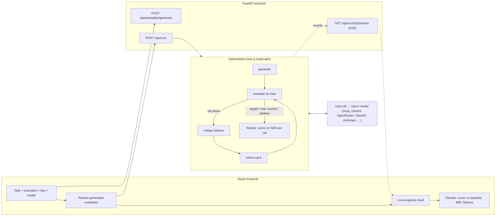

# PromptLoop

**Describe a task, give an example, and let your own model find the prompt that works
best — scored on examples it never saw.**

PromptLoop is an automatic prompt optimiser with a web UI. You fill in a task
description, one or more input → expected-output examples, your API key and your
preferred model. PromptLoop then:

1. drafts extra examples for you to review (one example isn't enough to score honestly),
2. writes 3 candidate prompts,
3. runs each on your examples with your model and scores the outputs,
4. has your model critique the best prompt's failures and write improved candidates,
5. repeats until the score stops improving,

and reports the best prompt, its score on held-out examples **vs. your task description
used as-is**, how the prompt evolved (word-level diffs), and the cases that still fail.

Everything runs on the user's key; the server stores no keys and no user data.

## Benchmarks

<!-- RESULTS:START -->
Held-out accuracy with `groq/qwen/qwen3.8-27b` (free tier) as both target and optimiser.
Baseline = the task description used as the prompt.

| task | scorer | train / val | baseline | optimised | Δ |
|---|---|---|---|---|---|
| [AG News](https://huggingface.co/datasets/fancyzhx/ag_news) topic classification | exact | 12 / 12 | 25% | **83%** | +58 pts |
| [GSM8K](https://huggingface.co/datasets/openai/gsm8k) maths, answer only | exact | 12 / 12 | 0% | **42%** | +42 pts |
| Invoice → JSON extraction (hand-written) | json_match | 12 / 6 | 67% | **97%** | +30 pts |

What drove the gains:

- **AG News:** the raw description doesn't say which labels to use; the optimised prompt
  learned the exact label set (`world`, `sports`, `business`, `sci/tech`) from examples.
- **Invoice:** the optimised prompt inferred unstated conventions (ISO dates, numeric
  totals, ISO currency codes, `null` for missing fields).
- **GSM8K:** the baseline always shows its working, so it never matches a bare number.
  Prompts that force a bare number fix the format but cost reasoning accuracy, and three
  rounds of refinement didn't beat round 1, so the loop stopped on a plateau. A scorer that
  extracts the final number from worked answers would separate those two effects.

Validation sets are small (a dozen examples, ~8 points each), so treat these as
indicative. Reproduce with the commands in [Development](#development).
<!-- RESULTS:END -->

## How it works



- **Honest scoring.** Examples are split into train and held-out val. The optimiser only
  ever sees train; val is used once, at the end, for the winner and for the baseline.
  The baseline (the task description itself) also competes in round 1, so a refined
  prompt has to actually beat it.
- **Scorers.** `exact` (normalised string match) for labels and short answers,
  `json_match` (JSON validity + per-field accuracy) for extraction, and an LLM `judge`
  with a rubric for free-form text. The web UI picks one automatically from the
  expected outputs.
- **Respects whatever tier the user is on.** No limits are imposed up front; every call
  goes through one client that backs off on 429s (honouring `Retry-After` and pausing
  all requests to that provider), and stops the run with a clear message if the quota
  runs out rather than counting it as wrong answers. Optional local limits and fallback
  models are in config, and a response cache makes reruns free.
- **Keys stay secret.** A user's key is held in memory for one run, never logged, cached
  or written to disk, and scrubbed from error messages.

## Quick start

Requires Python 3.12 and [uv](https://docs.astral.sh/uv/). Node 20+ for the frontend.

```bash
uv sync
cp .env.example .env          # add a free key, e.g. GROQ_API_KEY (dev/CLI only)

# CLI: score the baseline, then optimise
uv run promptloop baseline examples/tasks/invoice_extraction
uv run promptloop run examples/tasks/invoice_extraction

# Web app (API + built frontend on http://127.0.0.1:8000)
cd frontend && npm install && npm run build && cd ..
uv run promptloop serve
```

For frontend development, run `uv run promptloop serve --reload` and, in `frontend/`,
`npm run dev` (Vite proxies `/api` to the backend).

## Task folders (CLI)

```
examples/tasks/<name>/
  task.yaml      # name, description, scorer (exact | json_match | judge), optional models/rubric
  train.jsonl    # {"input": "...", "expected_output": "..."} per line, 10+ lines
  val.jsonl      # held-out examples, never shown to the optimiser
```

Model names, provider rate limits, fallbacks and loop settings live in
[`config/providers.yaml`](config/providers.yaml). CLI runs write every round plus a
markdown report to `runs/<timestamp>-<task>/`.

## API

| method | path | purpose |
|---|---|---|
| GET | `/api/config` | suggested models and limits for the form |
| POST | `/api/examples/generate` | draft extra examples from the user's seeds |
| POST | `/api/runs` | start a run (returns `run_id`) |
| GET | `/api/runs/{id}` | status, result, lineage, all events |
| GET | `/api/runs/{id}/events` | live progress as Server-Sent Events |
| DELETE | `/api/runs/{id}` | cancel |

Interactive docs at `/docs` when the server is running.

## Development

```bash
uv run ruff check . && uv run pytest     # offline; all LLM calls are mocked
uv run pytest -m live                    # real API calls, needs a key in .env
cd frontend && npm run typecheck
```

Benchmarks: `uv run python benchmarks/prepare.py && uv run python benchmarks/run.py`.
Deployment (Docker, Hugging Face Spaces, Render, Vercel): [`docs/DEPLOY.md`](docs/DEPLOY.md).

## Project layout

```
src/promptloop/
  config.py, models.py, data.py   settings, Pydantic models, task loading/splitting
  llm.py                          LiteLLM client: cache, rate limits, retries, fallback, keys
  prompts/*.txt                   the optimiser's own prompt templates
  scorers/                        exact, json_match, judge
  optimizer/                      synthesize, generate, execute, evaluate, critique, refine, graph
  report.py                       lineage, diffs, markdown report, run logs
  api/                            FastAPI app, run manager, SSE
  cli.py                          promptloop baseline | run | serve
frontend/                         React + TypeScript + Vite
benchmarks/                       public-dataset tasks and results
```
